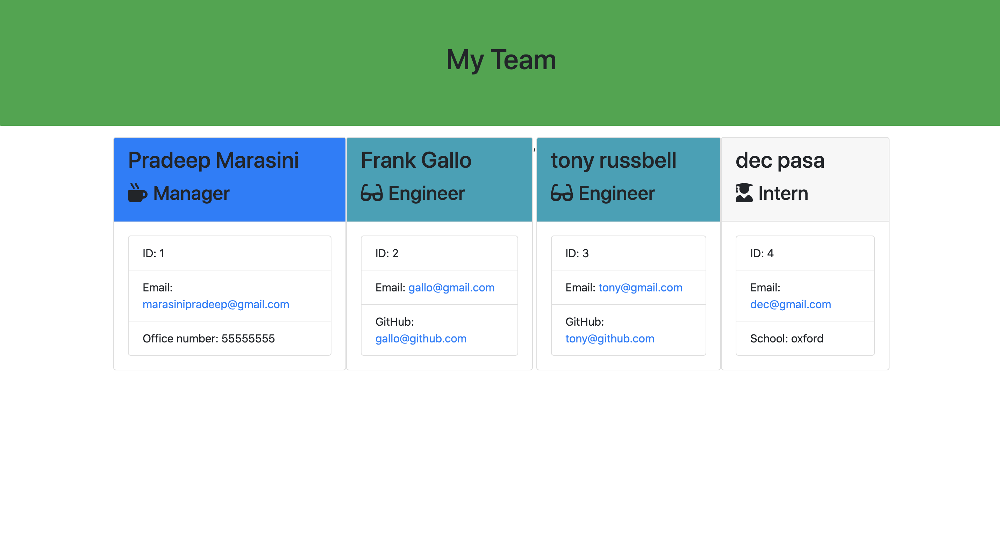

# team-profile-generator

A Node CLI that takes in information about employees and generates an HTML webpage that displays summaries for each person. 

## Description

This is asoftware engineering team generator command line application. The application will prompt the user for information about the team manager and then information about the team members. The user can input any number of team members, and they may be a mix of engineers and interns. This also pass all unit tests. When the user has completed building the team, the application will create an HTML file that displays a nicely formatted team roster based on the information provided by the user. The appication will invoked with following command:-

```
node app.js
```


## User Story
```
As a manager
I want to generate a webpage that displays my team's basic info
so that I have quick access to emails and GitHub profiles
```

## Table of Content
1. [Installation](#Installation)
2. [Usage](#Usage)
3. [License](#Licence)
4. [Contribution](#Contribution)
5. [Tests](#Tests)
6. [Questions](#Questions)
7. [StartBy](#StartBy)
8. [VideoLink](#VideoLink)


## Installation
The dependencies are [jest](https://jestjs.io/),[inquirer](https://www.npmjs.com/package/inquirer). Install the packages/dependencies by hitting following command on your terminal console:-
```
npm install

```

## Usage

Used for generating a webpage that displays team's basic info so that you can  have quick access to emails and GitHub profiles of employees.

## License

```
This is MIT license

```

## Contribution

```
When contributing to this repository, please first discuss the change you wish to make via issue, email, or any other method with the owner of this repository before making a change.
```


## Tests
Since testing is a key piece in making code maintainable, you will also be ensuring that all unit tests pass.It is recommended that you follow this workflow:

1. Run tests
2. Create or update classes to pass a single test case
3. RepeatJest is used for unit testing.

Run following command to run the test.

```
npm run test
```

## Questions
 <a href="https://github.com/marasinipradeep">Github Url : https://github.com/marasinipradeep</a>

 <a href="marasinipradeep@gmail.com">Email : marasinipradeep@gmail.com</a>

## StartBy

First of all, Clone the project from github to local machine.Alternatively, you can download the .zip file and extract in suitable folder on local machine.Open the file with suitable code editor (For examplle:-Visual Studio code, Sublime Text, Atom etc).Make sure you have installed all the dependencies.Run the file simply typing node app.js on code editor console.Directory structure that looks like this:

```
lib/           // classes and helper code
output/        // rendered output
templates/     // HTML template(s)
test/          // jest tests
  Employee.test.js
  Engineer.test.js
  Intern.test.js
  Manager.test.js
app.js         // Runs the application
```


## Snapshot of output



## VideoLink
<a href= "https://www.youtube.com/watch?v=a2Vwr1LLyiM&feature=youtu.be">Click here for demo video link</a>

```
Note :- To view this readme.md file in neat and cleaner view.On the top of header of README.md right click and click on open preview.
```
